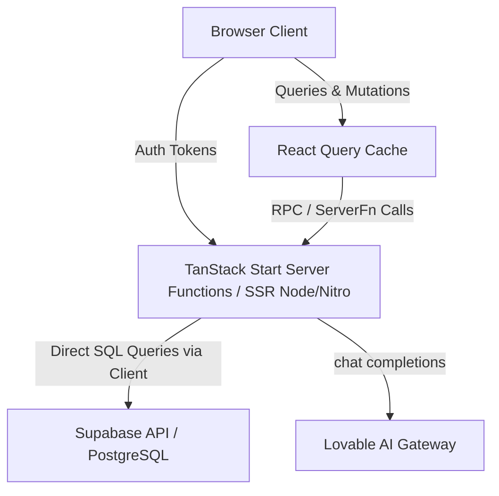

# Codebase Knowledge Base - Ev's HRMS

This knowledge base serves as a guide for understanding, analyzing, and extending the **Ev's HRMS** codebase.

---

## 1. System Overview & Technology Stack

**Ev's HRMS** is an enterprise-grade Human Resource Management System built with a modern, highly-integrated typescript stack:

*   **Frontend Framework**: [React 19](https://react.dev/)
*   **Routing & SSR**: [TanStack Start](https://tanstack.com/router/v1/docs/start/overview) (Server-Side Rendering + File-Based Routing)
*   **Data Fetching & Cache**: [TanStack Query v5](https://tanstack.com/query/latest) (React Query)
*   **Backend & DB**: [Supabase](https://supabase.com/) (PostgreSQL, Realtime, Authentication)
*   **Styling**: [Tailwind CSS v4](https://tailwindcss.com/) with `@tailwindcss/vite` integration
*   **Package Manager / Runtime**: [Bun](https://bun.sh/)
*   **AI Support**: **Zia AI Assistant** powered by Gemini via the Lovable AI Gateway

---

## 2. Codebase Architecture



### Key Directories

*   [`/src/routes/`](file:///c:/Projects/Ev%27s%20HRMS/src/routes/): Defines the routing tree using file-based conventions. The root layout is [`__root.tsx`](file:///c:/Projects/Ev%27s%20HRMS/src/routes/__root.tsx).
*   [`/src/features/`](file:///c:/Projects/Ev%27s%20HRMS/src/features/): Houses the React component views for the "live" modules.
*   [`/src/lib/`](file:///c:/Projects/Ev%27s%20HRMS/src/lib/): Contains API data-fetching functions (TanStack Start server functions), utilities, and routing configuration.
*   [`/src/integrations/`](file:///c:/Projects/Ev%27s%20HRMS/src/integrations/): Third-party clients.
    *   `/supabase/`: Supabase client initialization (`client.ts`), types (`types.ts`), and middlewares (`auth-attacher.ts` and `auth-middleware.ts`).
    *   `/lovable/`: Google OAuth helper wraps cloud authentication.
*   [`/public/screens/`](file:///c:/Projects/Ev%27s%20HRMS/public/screens/): Static HTML builds of pages that haven't been migrated to React yet.
*   [`/enterprise_logic/`](file:///c:/Projects/Ev%27s%20HRMS/enterprise_logic/): Contains design specifications (`DESIGN.md`).
*   `/nexus_hrms_*/`: Original static HTML and image mocks representing initial prototypes of each module.

---

## 3. Module Status (Live React Components)

All modules in the system are fully functional React components (wired to Supabase server functions via TanStack Start):

| Module | Route / Screen ID | Status | Implementation Details |
| :--- | :--- | :--- | :--- |
| **Dashboard** | `/dashboard` | 🟢 **Live** | Component: [`DashboardView`](file:///c:/Projects/Ev%27s%20HRMS/src/features/dashboard/dashboard-view.tsx)<br>Functions: [`dashboard.functions.ts`](file:///c:/Projects/Ev%27s%20HRMS/src/lib/dashboard.functions.ts) |
| **Employee Directory** | `/directory` | 🟢 **Live** | Component: [`DirectoryView`](file:///c:/Projects/Ev%27s%20HRMS/src/features/directory/directory-view.tsx)<br>Functions: [`employees.functions.ts`](file:///c:/Projects/Ev%27s%20HRMS/src/lib/employees.functions.ts) |
| **Time & Attendance** | `/attendance` | 🟢 **Live** | Component: `AttendanceView`<br>Functions: [`attendance.functions.ts`](file:///c:/Projects/Ev%27s%20HRMS/src/lib/attendance.functions.ts) |
| **Time-off (Leave)** | `/leave` | 🟢 **Live** | Component: [`LeaveView`](file:///c:/Projects/Ev%27s%20HRMS/src/features/leave/leave-view.tsx)<br>Functions: [`leave.functions.ts`](file:///c:/Projects/Ev%27s%20HRMS/src/lib/leave.functions.ts) |
| **Recruitment Hub** | `/recruitment` | 🟢 **Live** | Component: `RecruitmentView`<br>Functions: [`recruitment.functions.ts`](file:///c:/Projects/Ev%27s%20HRMS/src/lib/recruitment.functions.ts) |
| **Talent & Performance**| `/talent` | 🟢 **Live** | Component: `TalentView`<br>Functions: [`talent.functions.ts`](file:///c:/Projects/Ev%27s%20HRMS/src/lib/talent.functions.ts) |
| **Payroll & Expenses** | `/payroll` | 🟢 **Live** | Component: `PayrollView` |
| **Learning & Dev** | `/learning` | 🟢 **Live** | Component: `LearningView` |
| **Collaboration** | `/collaboration`| 🟢 **Live** | Component: `CollaborationView` |
| **HR Helpdesk** | `/helpdesk` | 🟢 **Live** | Component: `HelpdeskView` |
| **Advanced Analytics** | `/analytics` | 🟢 **Live** | Component: [`AnalyticsView`](file:///c:/Projects/Ev%27s%20HRMS/src/features/analytics/analytics-view.tsx)<br>Functions: [`dashboard.functions.ts`](file:///c:/Projects/Ev%27s%20HRMS/src/lib/dashboard.functions.ts) |
| **Assets & Devices** | `/assets` | 🟢 **Live** | Component: [`AssetsView`](file:///c:/Projects/Ev%27s%20HRMS/src/features/assets/assets-view.tsx)<br>Functions: [`assets.functions.ts`](file:///c:/Projects/Ev%27s%20HRMS/src/lib/assets.functions.ts) |
| **Pulse Surveys** | `/surveys` | 🟢 **Live** | Component: [`SurveysView`](file:///c:/Projects/Ev%27s%20HRMS/src/features/surveys/surveys-view.tsx)<br>Functions: [`surveys.functions.ts`](file:///c:/Projects/Ev%27s%20HRMS/src/lib/surveys.functions.ts) |
| **Benefits & Insurance**| `/benefits` | 🟢 **Live** | Component: [`BenefitsView`](file:///c:/Projects/Ev%27s%20HRMS/src/features/benefits/benefits-view.tsx)<br>Functions: [`benefits.functions.ts`](file:///c:/Projects/Ev%27s%20HRMS/src/lib/benefits.functions.ts) |
| **Succession Planning** | `/succession` | 🟢 **Live** | Component: [`SuccessionView`](file:///c:/Projects/Ev%27s%20HRMS/src/features/succession/succession-view.tsx)<br>Functions: [`succession.functions.ts`](file:///c:/Projects/Ev%27s%20HRMS/src/lib/succession.functions.ts) |
| **Zia AI Assistant** | `/zia` | 🟢 **Live** | Component: [`ZiaView`](file:///c:/Projects/Ev%27s%20HRMS/src/features/zia/zia-view.tsx)<br>Functions: [`zia.functions.ts`](file:///c:/Projects/Ev%27s%20HRMS/src/zia.functions.ts) |

---

## 4. Database Schema & Supabase Types

The PostgreSQL schema contains the following tables (refer to [`types.ts`](file:///c:/Projects/Ev%27s%20HRMS/src/integrations/supabase/types.ts) for exact properties):

### Core HR Tables
*   `departments`: List of corporate departments (`id`, `name`, `description`).
*   `employees`: Employees profile records (`id`, `employee_code`, `full_name`, `email`, `phone`, `job_title`, `location`, `status`, `hire_date`, `department_id`, `manager_id`, `user_id`).
*   `user_roles`: Maps `user_id` to an application role (`admin`, `manager`, `employee`).

### Attendance & Leaves
*   `attendance_logs`: Clock-in/out logs (`employee_id`, `clock_in`, `clock_out`, `work_date`, `status`).
*   `leave_types`: Configured leave types (`name`, `default_days`, `color`, `is_paid`).
*   `leave_balances`: Tracks leave allocation vs. usage (`employee_id`, `leave_type_id`, `allocated`, `used`, `year`).
*   `leave_requests`: Leave applications (`employee_id`, `leave_type_id`, `start_date`, `end_date`, `days`, `status`, `reason`, `approver_id`).

### Recruitment Hub
*   `jobs`: Job openings listings (`title`, `description`, `department_id`, `location`, `employment_type`, `openings`, `salary_min`, `salary_max`, `status`, `hiring_manager_id`).
*   `candidates`: Candidate contact info and notes (`full_name`, `email`, `phone`, `resume_url`, `linkedin_url`, `location`, `source`).
*   `applications`: Links candidates to jobs with stage tracking (`candidate_id`, `job_id`, `stage` enum, `rating`, `notes`).

### Performance & Goals
*   `goals`: Individual key results and trackers (`employee_id`, `title`, `description`, `progress`, `weight`, `due_date`, `status` enum).
*   `performance_reviews`: Review cycles (`employee_id`, `reviewer_id`, `cycle_name`, `period_start`, `period_end`, `overall_rating`, `strengths`, `improvements`, `status` enum).
*   `peer_feedback`: Peer-to-peer feedback (`from_employee_id`, `to_employee_id`, `type` enum, `visibility` enum, `message`).

---

## 5. Development Conventions

### A. Routing Conventions (TanStack Start)
TanStack Start uses file-based routing where folder names and file names declare path segments:
*   `index.tsx` maps to `/`.
*   `$id.tsx` denotes dynamic parameters (e.g. `user/$id.tsx` maps to `/user/:id`).
*   `_layout.tsx` is a layout route and should render nested routes via `<Outlet />`.
*   `__root.tsx` is the application shell enclosing every page.
*   Route generation is automated. **Do not modify `routeTree.gen.ts`**. It compiles automatically during development.

### B. Server Functions (ServerFn)
Always perform data access in server functions defined under `src/lib/` using `createServerFn`. 

Example pattern:
```typescript
import { createServerFn } from "@tanstack/react-start";
import { requireSupabaseAuth } from "@/integrations/supabase/auth-middleware";

export const getMyData = createServerFn({ method: "GET" })
  .middleware([requireSupabaseAuth]) // Injects validated context
  .handler(async ({ context }) => {
    const { supabase, userId } = context;
    const { data, error } = await supabase
      .from("my_table")
      .select("*")
      .eq("user_id", userId);
    if (error) throw new Error(error.message);
    return data;
  });
```

> [!IMPORTANT]
> **Cloudflare Workers Environment Binding**:
> Module-scope reads (e.g., `const url = process.env.SUPABASE_URL`) will evaluate to `undefined` on serverless workers. **Always wrap environment variable reads inside functions** or handlers (e.g. `getServerConfig()` or inside a request handler) to ensure correct environment evaluation during request-time.

### C. Authentication Middleware
*   **Client Session Passing**: [`attachSupabaseAuth`](file:///c:/Projects/Ev%27s%20HRMS/src/integrations/supabase/auth-attacher.ts) middleware runs in the client browser and automatically appends the Bearer token as an `Authorization` header on all server function RPC calls.
*   **Server Verification**: [`requireSupabaseAuth`](file:///c:/Projects/Ev%27s%20HRMS/src/integrations/supabase/auth-middleware.ts) validates the authorization Bearer header, extracts the JWT claims, instantiates a user-scoped Supabase client, and attaches `supabase`, `userId`, and `claims` to the `context`.

---

## 6. Design System & Styling (Modern Corporate)

Refer to the visual architecture guidelines in [`DESIGN.md`](file:///c:/Projects/Ev%27s%20HRMS/enterprise_logic/DESIGN.md):

*   **Colors**:
    *   **Surface / BG**: Cool Greys & Slate (`#F8FAFC`, `#0F172A`) for structured cards and tables.
    *   **Primary / Action**: Indigo Blue (`#3B82F6`) for links, filters, and major buttons.
    *   **Zia Accent**: Violet (`#8B5CF6`) gradients or glowing left-borders, reserved exclusively for AI elements.
*   **Typography**:
    *   Single typeface: **Inter** (imported from Google Fonts).
    *   Contrast relies on weight (`font-semibold` / `font-bold`) rather than drastic font-size leaps.
    *   `Body-sm` (12px) is used for data tables, metrics, and captions to optimize data density.
*   **Shape Rounding**:
    *   Buttons / Form inputs: `rounded` (4px / 0.25rem).
    *   Content Cards / Modals: `rounded-lg` (8px / 0.5rem).
    *   Status Chips / Badges: `rounded-full` (pill shape).

---

## 7. Setup & Run Instructions

To run the project locally, install dependencies using Bun:
```bash
bun install
bun dev
```

### Required Environment Variables (.env)
```env
SUPABASE_URL=https://your-project-id.supabase.co
SUPABASE_PUBLISHABLE_KEY=your-supabase-public-anon-key
LOVABLE_API_KEY=your-lovable-api-key # Used for Zia AI Chat Completing
```
